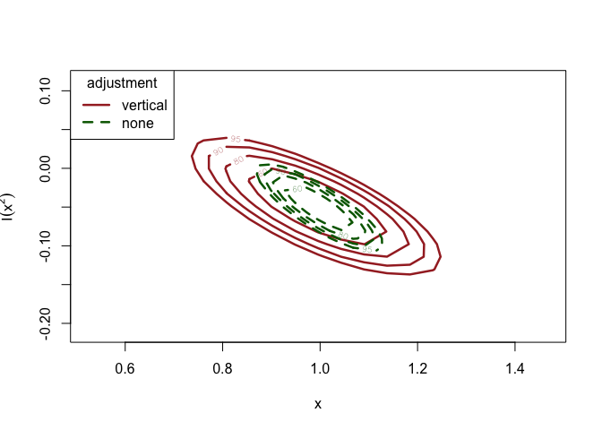

<!-- README.md is generated from README.Rmd. Please edit that file -->

# chantrics

<!-- badges: start -->


[](https://codecov.io/gh/tbruckbauer/chantrics)

[](https://www.codefactor.io/repository/github/tbruckbauer/chantrics)
<!-- badges: end -->

`chantrics` adjusts the loglikelihood of common econometric models for
clustered data based on the estimation process suggested in Chandler and
Bate (2007), using the
[chandwich](https://cran.r-project.org/package=chandwich) package, and
provides convenience functions for inference on the adjusted models.
`adj_loglik()` adjusts the parameter covariance matrix of the models to
incorporate clustered data, and can mitigate model misspecification by
wrapping `chandwich::adjust_loglik` for the supported models.

The returned model of class `chantrics` can be plugged into standard
model evaluation and model comparison methods, for example `summary()`,
`confint()` and `anova()`, and a hypothesis test framework provided by
`alrtest()`.

## Installation

You can install the released version of chantrics from
[CRAN](https://CRAN.R-project.org) with:

``` r
install.packages("chantrics")
```

The development version is available from [GitHub](https://github.com/)
with:

``` r
## Remove the # if "devtools" is not installed yet.
# install.packages("devtools")
devtools::install_github("tbruckbauer/chantrics")
```

## Usage

This example is using the misspecified count data regression from
Chapter 5.1 in the Object-Oriented Computation of Sandwich Estimators
vignette from the *sandwich* package (Zeileis 2006). First, data from a
negative binomial model is generated, and then a Poisson model is fit,
which is clearly misspecified.

``` r
library(chantrics)

set.seed(123)
x <- rnorm(250)
y <- rnbinom(250, mu = exp(1 + x), size = 1)

## Fit the Poisson glm model, which is not correctly specified
fm_pois <- glm(y ~ x + I(x ^ 2), family = poisson)
lmtest::coeftest(fm_pois)
#> 
#> z test of coefficients:
#> 
#>              Estimate Std. Error z value Pr(>|z|)    
#> (Intercept)  1.063268   0.041357 25.7094  < 2e-16 ***
#> x            0.996072   0.053534 18.6062  < 2e-16 ***
#> I(x^2)      -0.049124   0.023146 -2.1223  0.03381 *  
#> ---
#> Signif. codes:  0 '***' 0.001 '**' 0.01 '*' 0.05 '.' 0.1 ' ' 1
# The I(x^2) term is spuriously significant.
```

In order to mitigate the misspecification, the loglikelihood adjustment
is applied to the model object using `adj_loglik(model_object)`. If
clustered data is available, a vector or factor indicating from which
cluster the observation originates can be passed into the function using
`cluster`. If it is not supplied, it is assumed that each observation
originates from its own cluster and is independent. More information on
this can be found in the [clustering
vignette](https://chantrics.theobruckbauer.eu/articles/clustering-vignette.html).

``` r
## Apply the loglikelihood adjustment to the model
fm_pois_adj <- adj_loglik(fm_pois)
summary(fm_pois_adj)
#>                  MLE      SE adj. SE
#> (Intercept)  1.06300 0.04136 0.08378
#> x            0.99610 0.05353 0.10520
#> I(x^2)      -0.04912 0.02315 0.03628
lmtest::coeftest(fm_pois_adj)
#> 
#> z test of coefficients:
#> 
#>              Estimate Std. Error z value Pr(>|z|)    
#> (Intercept)  1.063268   0.083776 12.6918   <2e-16 ***
#> x            0.996072   0.105217  9.4668   <2e-16 ***
#> I(x^2)      -0.049124   0.036284 -1.3539   0.1758    
#> ---
#> Signif. codes:  0 '***' 0.001 '**' 0.01 '*' 0.05 '.' 0.1 ' ' 1
# The I(x^2) term is no longer significant.

# Produce confidence intervals for the parameter estimates
chandwich::conf_intervals(fm_pois_adj)
#> Waiting for profiling to be done...
#> Model: poisson_glm_lm 
#> 
#> 95% confidence intervals, adjusted loglikelihod with type = ''vertical'' 
#> 
#> Symmetric:
#>              lower     upper   
#> (Intercept)   0.89907   1.22747
#> x             0.78985   1.20229
#> I(x^2)       -0.12024   0.02199
#> 
#> Profile likelihood-based:
#>              lower    upper  
#> (Intercept)   0.8954   1.2232
#> x             0.7877   1.1991
#> I(x^2)       -0.1198   0.0222
# Generate a nested model from fm_pois_adj
fm_pois_small_adj <- update(fm_pois_adj, . ~ . - I(x^2))
lmtest::coeftest(fm_pois_small_adj)
#> 
#> z test of coefficients:
#> 
#>             Estimate Std. Error z value  Pr(>|z|)    
#> (Intercept)  1.05525    0.08111  13.010 < 2.2e-16 ***
#> x            0.90172    0.06939  12.995 < 2.2e-16 ***
#> ---
#> Signif. codes:  0 '***' 0.001 '**' 0.01 '*' 0.05 '.' 0.1 ' ' 1
# Perform an adjusted likelihood ratio test on the two models
anova(fm_pois_adj, fm_pois_small_adj)
#> Analysis of Adjusted Deviance Table
#> 
#> Model 1: y ~ x + I(x^2)
#> Model 2: y ~ x
#> 
#>   Resid.df df  ALRTS Pr(>ALRTS)
#> 1      247                     
#> 2      248  1 1.8202     0.1773
# Similarly, specify to remove I(x^2) from the larger model
alrtest(fm_pois_adj, "I(x^2)")
#> Adjusted likelihood ratio test
#> 
#> Model 1: y ~ x + I(x^2)
#> Model 2: y ~ x
#> 
#>   Resid.df df  ALRTS Pr(>ALRTS)
#> 1      247                     
#> 2      248  1 1.8202     0.1773
# Plot confidence regions for the parameter estimates
fm_pois_adj_vert <-
  chandwich::conf_region(fm_pois_adj, which_pars = c("x", "I(x^2)"))
#> Waiting for profiling to be done...
fm_pois_adj_none <-
  chandwich::conf_region(fm_pois_adj,
    which_pars = c("x", "I(x^2)"),
    type = "none"
  )
#> Waiting for profiling to be done...
plot(
  fm_pois_adj_vert,
  fm_pois_adj_none,
  conf = c(60, 80, 90, 95),
  col = c("brown", "darkgreen"),
  lty = c(1, 2),
  lwd = 2.5
)
```



More information on the different methods can be found in the
[Introducing chantrics
vignette](https://chantrics.theobruckbauer.eu/articles/chantrics-vignette.html),
and in the corresponding help pages.

## References

<div id="refs" class="references csl-bib-body hanging-indent">

<div id="ref-chanbate07" class="csl-entry">

Chandler, Richard E., and Steven Bate. 2007. “Inference for Clustered
Data Using the Independence Loglikelihood.” *Biometrika* 94 (1): 167–83.
<https://doi.org/doi:10.1093/biomet/asm015>.

</div>

<div id="ref-zeileis06" class="csl-entry">

Zeileis, Achim. 2006. “Object-Oriented Computation of Sandwich
Estimators.” *Journal of Statistical Software, Articles* 16 (9): 1–16.
<https://doi.org/10.18637/jss.v016.i09>.

</div>

</div>
